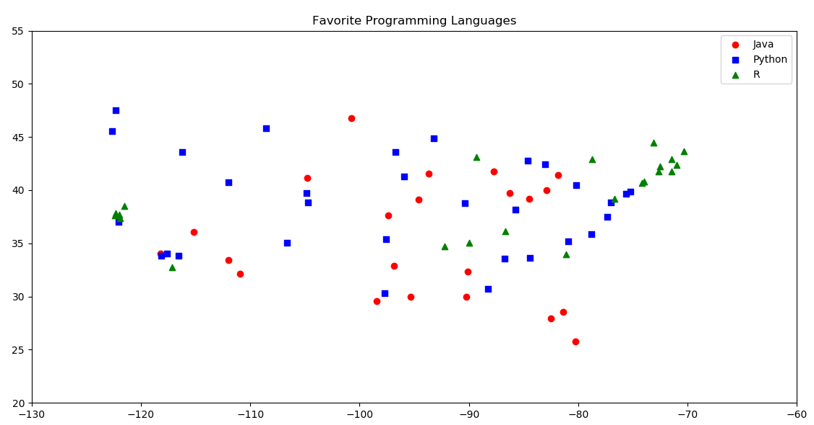
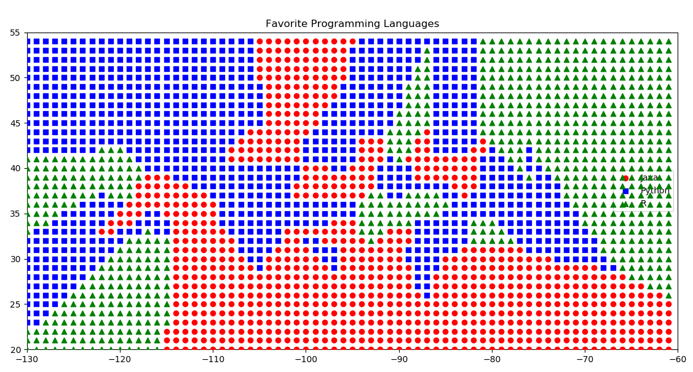
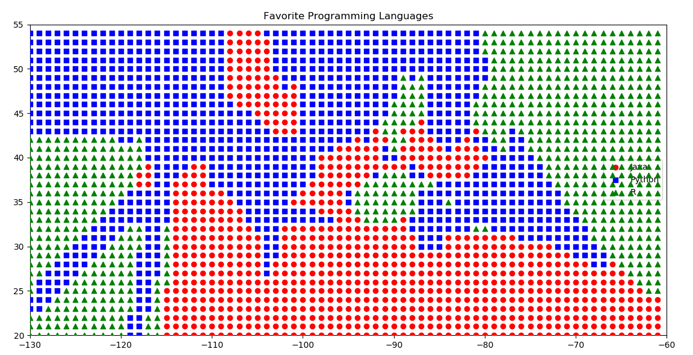

# cmpe255-spring19-lab5

## Results

K=1, neighbor[s]: 40 correct out of 75

K=3, neighbor[s]: 44 correct out of 75

K=5, neighbor[s]: 41 correct out of 75

K=7, neighbor[s]: 35 correct out of 75

## Original datapoints:

## Scatterplot with K=1

## Scatterplot with K=2

## Scatterplot with K=3

